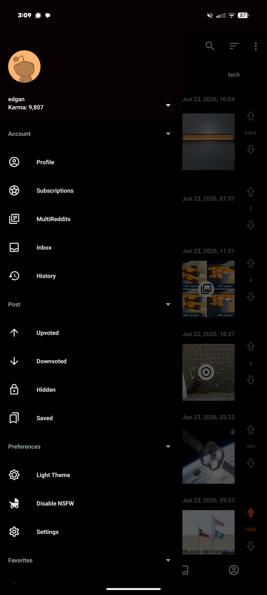
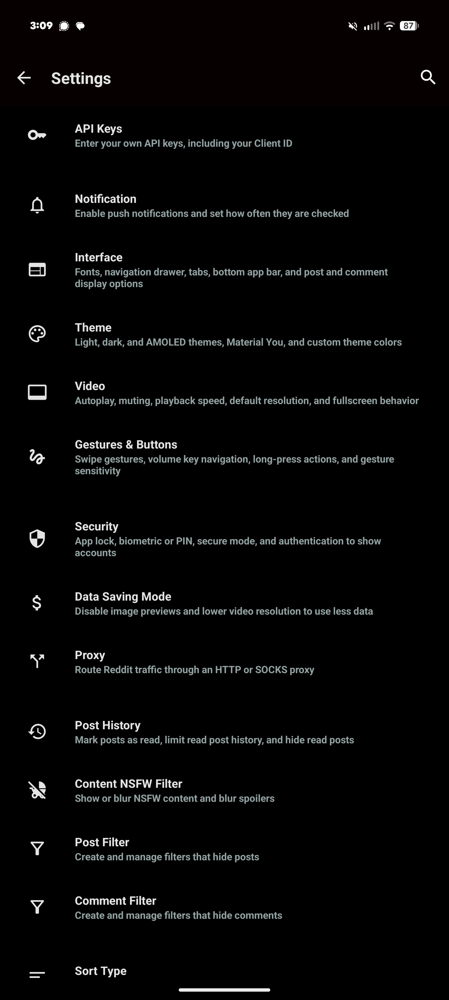
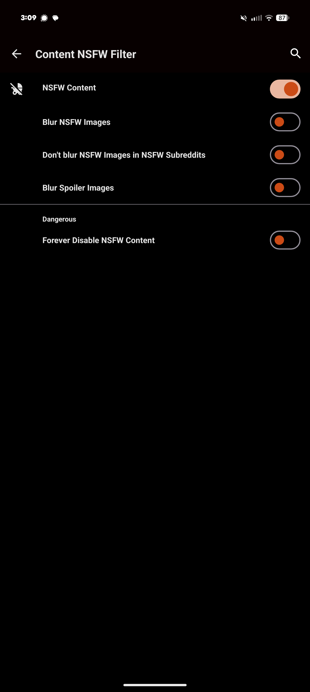
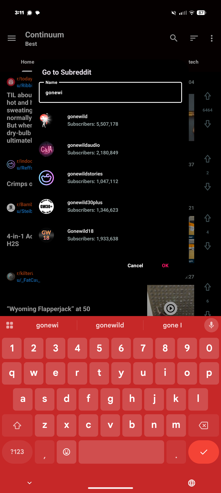
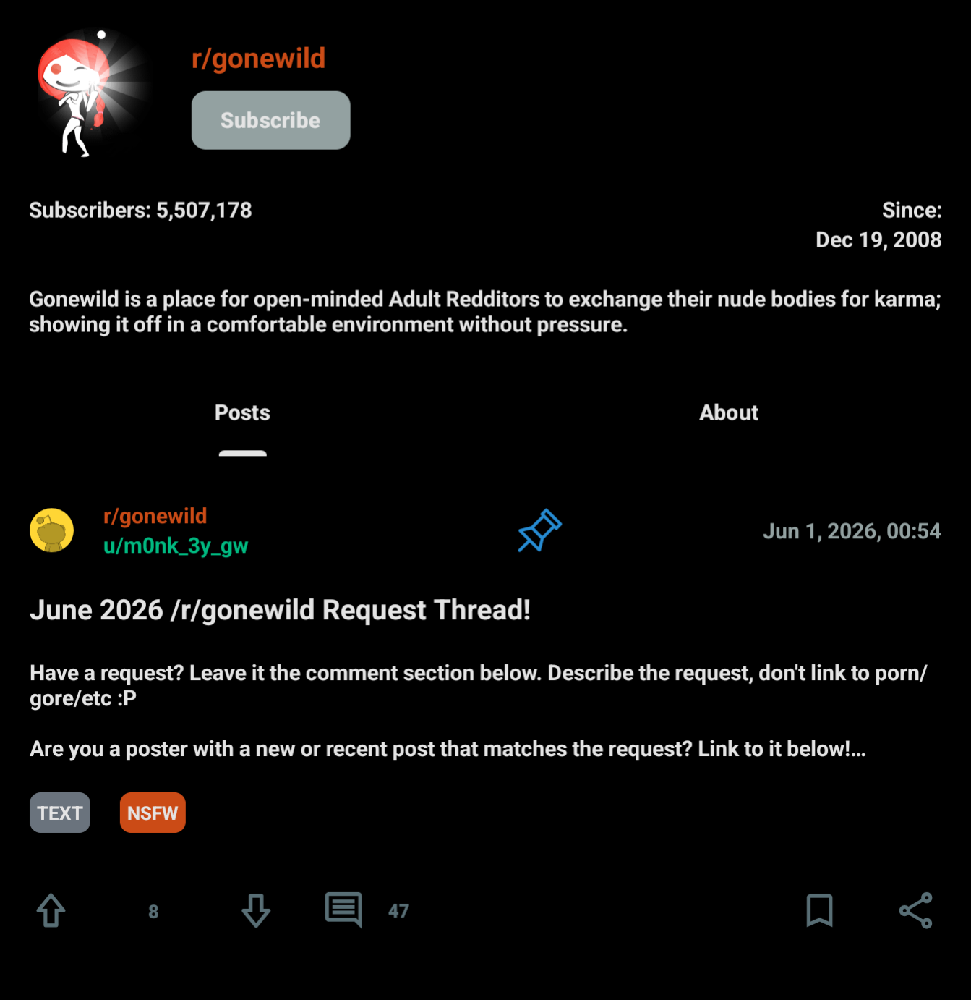

# Frequently asked questions

## Why can't I login?

There can be issues with `Android System Webview`. See [Common errors](/SETUP.md#common-errors) in [SETUP.md](/SETUP.md).

Things to try:
1. Trying using a VPN, or try not using one if you are. Also try from a USA server.
2. Try different Internet connections like cellular Internet access, and WiFi internet access
3. Try the WebView and external browser options
4. Try a different Reddit account

## Why can't I view `NSFW` content?

1. Lack of `show mature (18+) content` blocks it in search. So enable it per account.
2. Lack of being a `moderator` gets you the `Go to Reddit to view mature content` message when you visit a `NSFW` subreddit. So create a subreddit to become a `moderator`. Either one subreddit per `Reddit` account or one subreddit and make all your accounts `moderators` of it.
3. The app settings block it in search, as in `Go to Subreddit`.

### Website

  <picture>
    <source
      width="512x"
      media="(prefers-color-scheme: dark)"
      srcset="assets/screenshots/nsfw-old-reddit-com-prefs.png"
    >
    
  </picture>

  <picture>
    <source
      width="1024x"
      media="(prefers-color-scheme: dark)"
      srcset="assets/screenshots/nsfw-hide-images-for-nsfw-content.png"
    >
    
  </picture>

  <picture>
    <source
      width="1024x"
      media="(prefers-color-scheme: dark)"
      srcset="assets/screenshots/nsfw-show-mature-content.png"
    >
    
  </picture>

### Continuum

  <picture>
    <source
      width="192x"
      media="(prefers-color-scheme: dark)"
      srcset="assets/screenshots/nsfw-navigation-bar.png"
    >
    
  </picture>
  <picture>
    <source
      width="192x"
      media="(prefers-color-scheme: dark)"
      srcset="assets/screenshots/nsfw-settings-content-nsfw-filter.png"
    >
    
  </picture>
  <picture>
    <source
      width="192x"
      media="(prefers-color-scheme: dark)"
      srcset="assets/screenshots/nsfw-settings-nsfw-connect.png"
    >
    
  </picture>
  <picture>
    <source
      width="192x"
      media="(prefers-color-scheme: dark)"
      srcset="assets/screenshots/nsfw-go-tos-subreddit.png"
    >
    
  </picture>

  <picture>
    <source
      width="256x"
      media="(prefers-color-scheme: dark)"
      srcset="assets/screenshots/nsfw-gonewild.png"
    >
    
  </picture>

